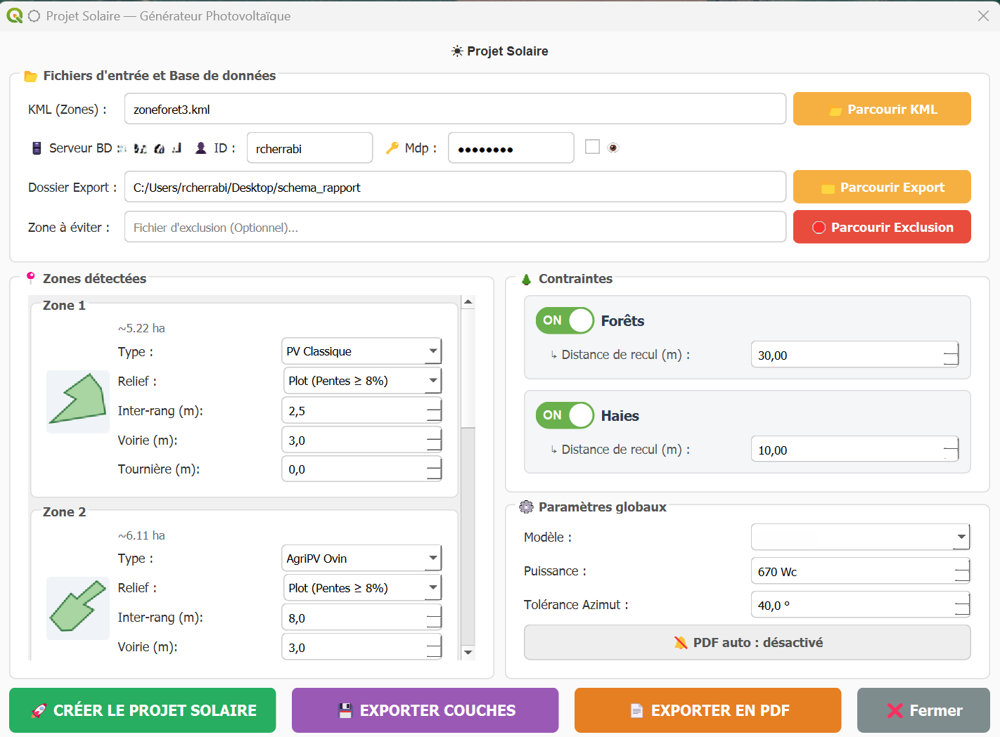

☀️ Solar Layout Generator — Simulateur de Faisabilité & Calepinage Solaire

Extension PyQGIS d'ingénierie d'avant-projet pour l'évaluation instantanée du potentiel solaire, la modélisation des contraintes et l'optimisation du calepinage.

---

📌 Introduction : Le besoin d'une évaluation instantanée

Lors de la phase de prospection, l'identification d'un terrain présentant un potentiel solaire constitue l'étape charnière de tout développement. Pour valider la viabilité d'un futur parc, les chefs de projets ont l'impératif d'estimer, avec une précision croissante, la puissance installable d'un site dès les premiers contacts fonciers. Cette simulation technique est complexe par nature : elle impose la convergence d'une multitude de contraintes géographiques, techniques et environnementales. L'analyse doit intégrer simultanément les déclivités du terrain, les voiries, la déduction des tournières nécessaires aux manœuvres agricoles, ainsi que les zones d'exclusion strictes liées aux forêts, aux haies bocagères ou aux divers périmètres de protection réglementaires (servitudes, zones protégées, inventaires biodiversité).   

Dans le fonctionnement organisationnel classique, cette analyse repose sur une intervention manuelle répétée du service cartographie, générant un goulot d'étranglement face à la volatilité du marché foncier. Pour s'affranchir de cette inefficience systémique, Solar Layout Generator automatise entièrement ce processus itératif, permettant aux chefs de projets de qualifier eux-mêmes leurs sites en quelques instants.

---

## 🖥️ Aperçu de l'application

### Console de pilotage PyQt

🗺️ Restitution cartographique : De la donnée brute au projet optimisé
.png)
